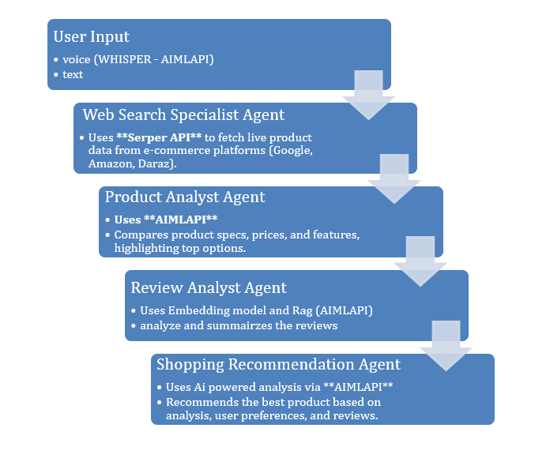

# 🛍️ ShopSmart.AI - Intelligent Shopping Assistant Powered by AIMLAPI and CrewAI

Welcome to the **ShopSmart.AI** repository!  
This project is an **Intelligent Shopping Assistant**, built for the **Execute: AI Genesis Hackathon 2025**.  
It enhances shopping experiences using **multi-agent collaboration** and **end-to-end AI services via AIMLAPI**, providing **personalized product recommendations**, **review analysis**, and **voice interaction** — all in one place.

---

## 📚 Table of Contents

1. [Overview](#overview)
2. [Features](#features)
3. [Tech Stack & Gen AI Capabilities](#tech-stack--gen-ai-capabilities)
4. [Setup and Installation](#setup-and-installation)
5. [Usage](#usage)
6. [Contributing](#contributing)
7. [License](#license)

---

## 🚀 Overview

**ShopSmart.AI** uses intelligent agents built with **CrewAI** and entirely powered by **AIMLAPI** services:
- Product search and structured extraction (name, price, image URL, rating, etc.)
- LLM-based reasoning and recommendations
- Voice-to-text input handling (Whisper via AIMLAPI)
- Review summarization using RAG with embeddings (via AIMLAPI)

---

## ✨ Features

- **Personalized Recommendations**: Suggests best-fit products based on user queries and preferences.
- **Multi-Agent System**: Intelligent agents collaborate using CrewAI for product search, analysis, and summarization.
- **Voice & Text Input Support**: Users can interact via typing or speaking (speech recognition powered by AIMLAPI).
- **Product Search & Comparison**: Searches across platforms and compares multiple products.
- **Review Summarization**: Summarizes user reviews to assist in faster, smarter decision-making using RAG.
- **Updated Product Information**: Retrieves product **Name, Price, Image URL, Ratings, Reviews**, and more in real-time.
- **Powered Entirely by AIMLAPI**: All LLM, embeddings, retrievals, and speech-to-text functionalities handled via AIMLAPI.
- **User-Friendly Interface**: Built with Streamlit for seamless and simple interaction.

---

## 🛠️ Technologies, Tools & Gen AI Capabilities Mapping

| Component                          | Purpose                                                                       | Gen AI Capability Demonstrated                                     |
|------------------------------------|-------------------------------------------------------------------------------|--------------------------------------------------------------------|
| `AIMLAPI - LLM`                    | Provides reasoning, analysis, product recommendations                        | ✅ Natural Language Understanding<br>✅ Structured Output Generation |
| `AIMLAPI - Embeddings`             | Semantic vector search and document retrieval for RAG                       | ✅ Semantic Search<br>✅ Retrieval-Augmented Generation (RAG)        |
| `AIMLAPI - Whisper (Speech-to-Text)`| Converts user voice input into text                                           | ✅ Voice Recognition<br>✅ Conversational Interface                  |
| `AIMLAPI - Web Search + Scraping`  | Retrieves product details (Name, Price, Image URL, Ratings, etc.)             | ✅ Information Retrieval<br>✅ Structured Data Extraction            |
| `CrewAI`                           | Orchestrates multiple AI agents for workflow management                      | ✅ Multi-Agent Collaboration                                        |
| `Streamlit`                        | Web application interface for user interaction                               | ✅ Real-time User Interaction                                       |
| `Python (Colab / Local)`            | Programming environment for prototyping and deployment                       | ✅ Experimentation and Development                                 |

---



---

## 🛠️ Setup and Installation

Follow these steps to set up and run the project locally:

1. **Clone the Repository**:
   ```bash
   git clone https://github.com/SheemaMasood381/Intelligent-Shopping-Assistant-with-CrewAi.git
   cd Intelligent-Shopping-Assistant-with-CrewAi
   ```

2. **Create a Virtual Environment** (Optional but recommended):
   ```bash
   python3 -m venv venv
   source venv/bin/activate   # For Linux/Mac
   venv\Scripts\activate      # For Windows
   ```

3. **Install Required Dependencies**:
   ```bash
   pip install -r requirements.txt
   ```

4. **Run the Application**:
   ```bash
   python app.py
   ```

---

# Streamlit App for Smart Product Recommendations

## 🚀 Usage

### After setting up:

Run the Streamlit App:

```bash
streamlit run app.py
```

### Interact with the Assistant:

- **Enter a text query** (e.g., "Find me a budget smartphone under $300")
- **Or Speak your query directly** (Speech Recognition enabled via AIMLAPI Whisper)

### View recommended products with:

- **Name**
- **Price**
- **Image**
- **Ratings**
- **Summarized reviews**

Get smart recommendations generated by CrewAI agents and LLMs.

---

## 🤝 Contributing

Contributions are welcome! Please fork the repo and submit a pull request.

---

## 📜 License

This project is licensed under the [MIT License](LICENSE).

---

## 📩 Contact

- **Email**: [sheemamasood381@gmail.com](mailto:sheemamasood381@gmail.com) | [mmasood04@gmail.com](mailto:mmasood04@gmail.com)
- **GitHub**: [SheemaMasood381](https://github.com/SheemaMasood381)

---

